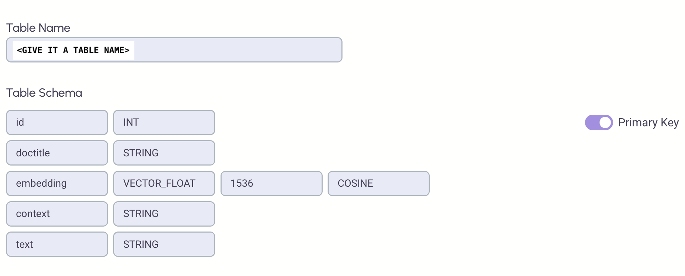

# Question And Answer Against A Set Of Documents

## Step 1. Install the following python libraries

```
pip install streamlit
pip install python-dotenv
pip install langchain
pip install openai
pip install pyepsilla
pip install pypdfium2
pip install numexpr
```

## Step 2. On Epsilla Cloud, create a vector DB and a vector table. The table needs to follow this schema:



## Step 3. Prepare an .env file in the folder, with the following content (replace the keys)

```
OPENAI_KEY=<YOUR OPEN AI KEY>
EPSILLA_API_KEY=<YOUR EPSILLA CLOUD PROJECT'S API KEY>
PROJECT_ID=<YOUR EPSILLA CLOUD PROJECT ID>
DB_ID=<YOUR EPSILLA CLOUD VECTOR DB ID>
TABLE_NAME=<YOUR EPSILLA CLOUD VECTOR DB'S TABLE NAME>
```

## Step 4. Move all PDF files under ./documents/ folder

## Step 5. Learn all the documents

```
python learn.py
```

## Step 6. Run the app

```
streamlit run app.py
```

## Here is an example question & answer


